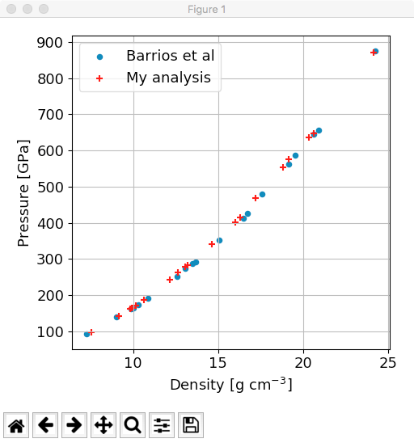
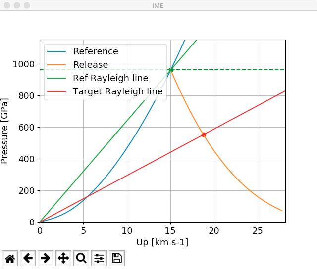
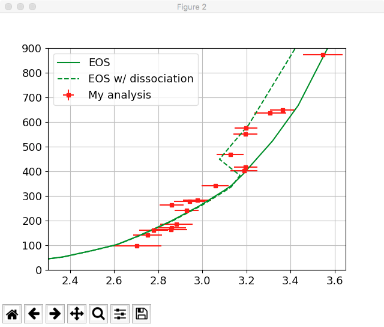

# Analysis of Polystyrene data

This script performs an analysis of the data published in:

>M. A. Barrios, D. G. Hicks, T. R. Boehly, D. E. Fratanduono, J. H. Eggert, P. M. Celliers, G. W. Collins, and D. D. Meyerhofer, "High-precision measurements of the equation of state of hydrocarbons at 1–10 MBar using laser-driven shock waves," Physics of Plasmas, vol. 17, p. 056307, may 2010.

The script can be run in iPython in the typical way:

~~~python
%run barrios_analysis.py
~~~

This will open up two windows:

The first displayes the data taken by Barrios et al and analyses using the quartz impeadance standard developed by Hicks et al. as well as the data reanalyzed with a different standard. 

This standard can be changed in the initilization of the Quartz EOS in the script. 

~~~python
    q = EOS("../data/eos_24.dat", 
            hugoniot_method="analytic",
            upmin=0,
            upmax=29,
            UsvUp=quartz_UsvUp(model="knudson")
            )
~~~

The data points on this image are clickable. Doing so will open a new plot, with the impedenace matching analysis shown. 

Error bars shown on the data are generated by a monte carlo error propogation routine wherein the impedenance matchin analysis is performed for data pints within the recorded error bars by Barrios et al.

The second plot displayes the hugoniot of Polystyrene with a dissociation energy added to the EOS.

